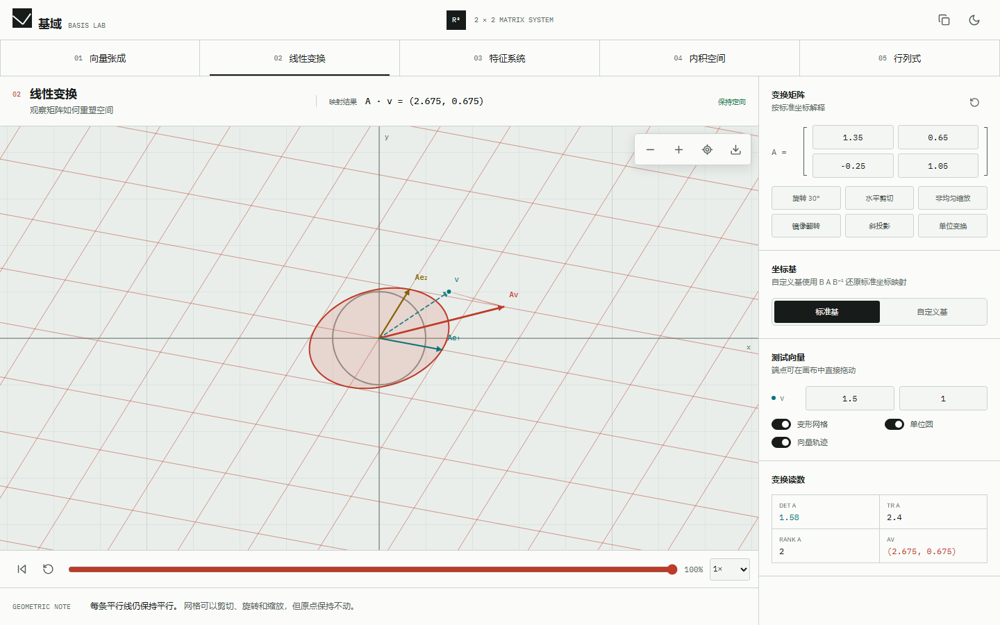

# 基域 · BASIS LAB

[](https://github.com/Shrimpaste/LinearAlgebraVisualization/actions/workflows/ci.yml)
[](https://github.com/Shrimpaste/LinearAlgebraVisualization/actions/workflows/pages.yml)
[](LICENSE)

基域是一套面向二维线性代数的交互式可视化工作台。它把矩阵、向量和抽象性质放回同一个可操作空间：可直接编辑数值、拖动画布端点、逐帧观察变换，并同步读取公式、数值状态与退化边界。

**[打开在线版本](https://shrimpaste.github.io/LinearAlgebraVisualization/)**



## 核心场景

| 场景     | 可视化内容                               | 交互与边界处理                             |
| -------- | ---------------------------------------- | ------------------------------------------ |
| 向量张成 | 秩、线性相关、目标分解、系数格与线性组合 | 拖动向量和目标点，识别零向量与退化基       |
| 线性变换 | 变形网格、单位圆、测试向量轨迹           | 自定义矩阵与基，展示 `B A B^-1` 和奇异状态 |
| 特征系统 | 实特征方向、方向场、幂迭代轨迹           | 覆盖双实根、重根、缺陷矩阵与共轭复根       |
| 内积空间 | 投影、度量角、正交化                     | 标准/加权/相关/自定义度量，验证 SPD 条件   |
| 行列式   | 有向面积、定向翻转和坍缩                 | 播放列变换，解释缩放、换列与加列操作       |

所有场景共享确定性时间轴、暂停/重播/拖动、速度控制、缩放和平移、视图复位、PNG 导出、浅色/深色主题及本地状态恢复。界面支持键盘焦点、Canvas 文本替代、响应式移动布局和减少动态效果偏好。

## 快速开始

需要 Node.js 20 或更高版本，推荐使用与自动化环境一致的 Node.js 22。

```bash
git clone https://github.com/Shrimpaste/LinearAlgebraVisualization.git
cd LinearAlgebraVisualization
npm ci
npm run dev
```

项目没有环境变量、后端服务或外部 API 依赖。开发服务器默认为 `http://127.0.0.1:5173/`；端口被占用时可运行 `npm run dev -- --port 5174`。首次运行端到端测试前安装 Chromium：

```bash
npx playwright install chromium
npm run verify:full
```

Linux CI 或新工作站可用 `npx playwright install --with-deps chromium` 同时安装系统依赖。完整验收成功时，命令会通过格式、类型、Lint、单测、构建及两个浏览器尺寸的 Playwright 用例。

## 常用命令

| 命令                  | 用途                                 |
| --------------------- | ------------------------------------ |
| `npm run dev`         | 启动 Vite 开发服务器                 |
| `npm run build`       | 执行 TypeScript 构建并输出 `dist/`   |
| `npm run preview`     | 本地预览生产构建                     |
| `npm run format`      | 使用 Prettier 格式化仓库文件         |
| `npm run test`        | 运行 Vitest 单元与组件测试           |
| `npm run test:e2e`    | 运行桌面端与 Pixel 7 Playwright 验收 |
| `npm run verify`      | 格式、类型、Lint、单测和生产构建门禁 |
| `npm run verify:full` | `verify` 加完整浏览器验收            |

## 工程结构

```text
src/
  app/                  场景注册表与应用类型
  components/           工作台、可视化舞台和可访问控件
  engine/               高 DPI Canvas、视口与确定性时间轴
  hooks/                响应式与持久化状态
  math/                 无浏览器依赖的二维线性代数纯函数
  rendering/            无状态 Canvas 绘图基元
  scenes/               五个独立场景的模型与界面
  styles/               设计令牌与响应式布局
  utils/                数值与公式格式化
e2e/                    Playwright 产品级验收
```

数学、动画、视口、绘制和 React 状态保持分层；场景通过注册表接入应用外壳。详细设计与扩展约定见[架构说明](docs/ARCHITECTURE.md)。

## 构建与发布

生产资源使用相对路径，场景导航使用 URL hash，因此产物可部署到 GitHub Project Pages 子路径或任意静态文件服务器。推送到 `main` 后，`deploy-pages` 工作流会执行包括桌面/移动浏览器验收在内的完整质量门禁、构建 `dist/`、上传 Pages artifact，并通过 GitHub OIDC 部署。

首次启用、手动发布、回滚与故障排查见[部署手册](docs/DEPLOYMENT.md)。参与开发前请阅读[贡献指南](CONTRIBUTING.md)。

## 浏览器支持

支持当前稳定版 Chrome、Edge、Firefox 与 Safari。自动化验收以 Chromium 为基准；渲染只依赖 Canvas 2D，不需要 WebGL、后端服务或外部运行时 API。

## 许可证

本项目基于 [MIT License](LICENSE) 开源。
